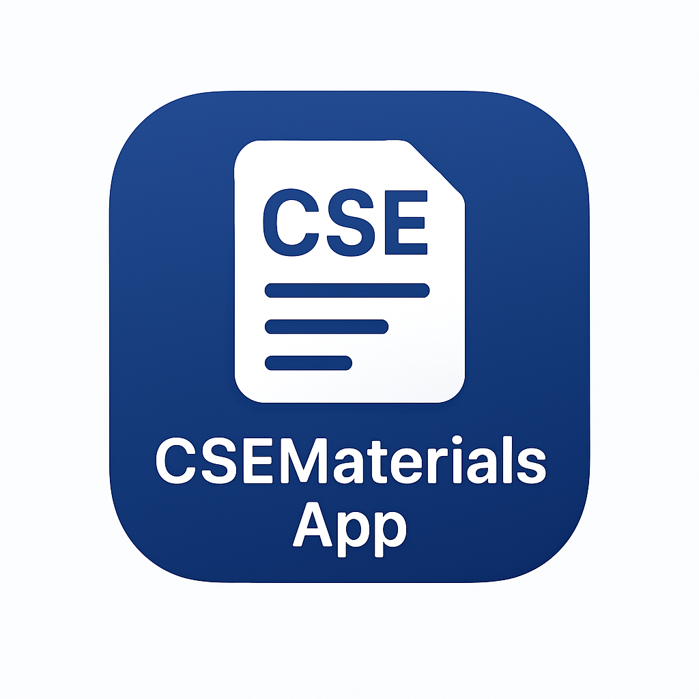

# Chat Hub Flutter App

  

**Chat Hub** is a comprehensive educational Flutter app that allows students to access course materials, previous exam questions, quizzes, and more in an organized and user-friendly interface. The app also integrates AI-based recommendations to enhance learning and productivity.

---

## **Table of Contents**

- [About the App](#about-the-app)  
- [Features](#features)  
- [Admin Panel](#admin-panel)  
- [Backend](#backend)  
- [Installation](#installation)  
- [Usage](#usage)  
- [Contributing](#contributing)  
- [License](#license)  

---

## **About the App**

Chat Hub is designed to help students access learning materials efficiently. It provides:

- Semester-wise course lists  
- Course-specific materials  
- Previous year question papers and quizzes  
- AI-based recommendations for personalized learning  
- Bookmarking for quick access  
- Search functionality across semesters, courses, and materials  
- Profile management including password changes and profile editing  

The app ensures seamless access to educational resources, both online and offline, through Firebase and Supabase integration.

---

## **Features**

### **User Features**

- **Login & Authentication**: Secure login system for students.  
- **Home Page**: Overview of courses, recommended materials, and quick links.  
- **Course List**: Browse courses by semester.  
- **Materials List**: Access all materials for each course.  
- **Material Details**: View detailed information about each material.  
- **Previous Year Questions**: Find term exams, class tests, and quizzes; filterable by topic or year.  
- **Bookmarks**: Save important materials for quick access.  
- **Search Page**: Search any semester, course, or material.  
- **Profile Management**: Edit profile, change password, view personal information.  
- **Customized Splash Screen**: A unique splash screen on app launch.  

### **Admin Features**

- **Admin Panel**: Admin can upload materials, manage courses, and update content.  
- **Material Management**: Add, edit, or delete materials with ease.  
- **User Management**: Monitor user activity and manage access.  

### **AI Integration**

- Provides AI-based recommendations for materials to enhance student learning and productivity.

---

## **Backend**

The app is powered by modern backend services:

- **Firebase Authentication**: Secure login and user management.  
- **Cloud Firestore**: Real-time database for courses, materials, and user interactions.  
- **Supabase**: Additional backend services for scalable storage and data management.  

## **Installation**

1. **Clone the repository**

```bash
git clone https://github.com/username/chat_hub_flutter.git
cd chat_hub_flutter
